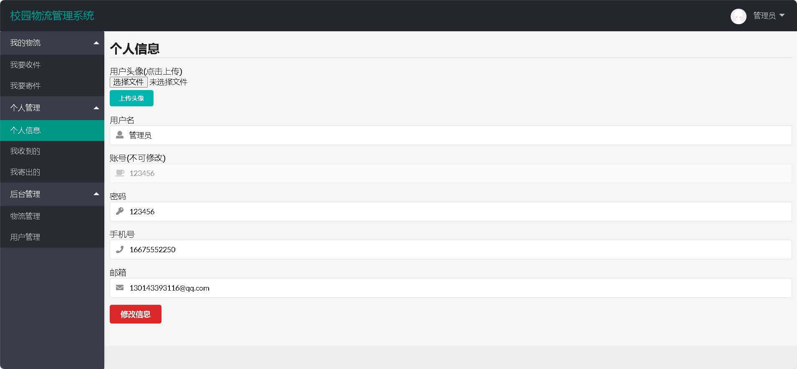
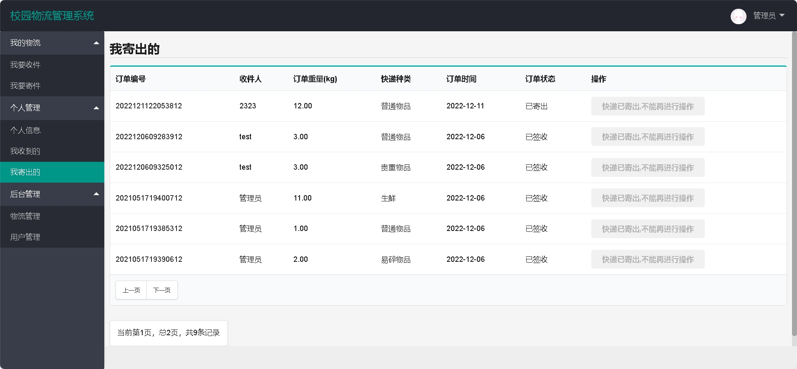
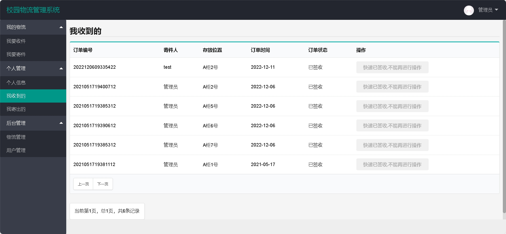
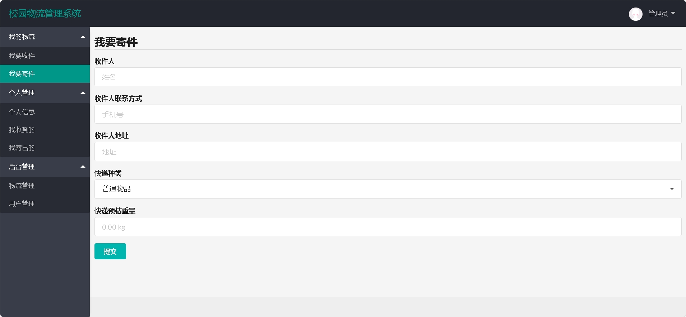
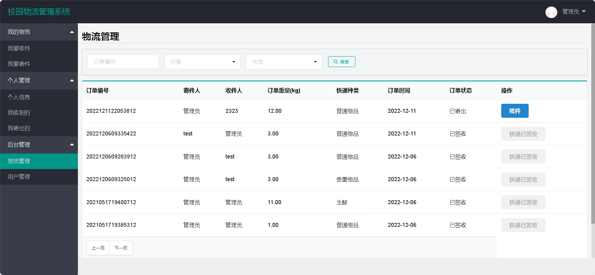
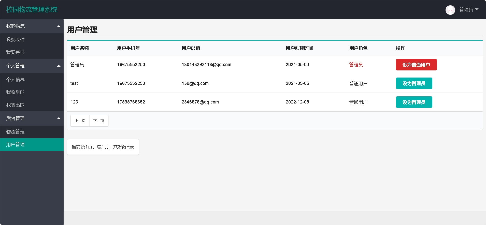

 
## 查看主页获取源码

> **作者介绍**： **✌**全网粉丝10W+本平台特邀作者、博客专家、CSDN新星计划导师、java领域优质创作者,博客之星、掘金/华为云/阿里云/InfoQ等平台优质作者、专注于毕业项目实战 **✌**

  

### 一、作品包含

源码+数据库+全套环境和工具资源+部署教程

### 二、项目技术

前端技术：Html、Css、Js、Layui

数据库：MySQL

后端技术：Java、Spring Boot、MyBatis

  

### 三、运行环境

开发工具：IDEA

数据库：MySQL8.0

数据库管理工具：Navicat10以上版本

环境配置软件： JDK1.8+Maven3.6.3
  

### 四、项目介绍
项目编号：springbootA037

快件管理：用户可以查看、跟踪和搜索所有快件，包括待收、收件、寄件和已完成快件。
用户管理：系统允许管理员对用户信息进行添加、查看、修改或删除，以及对用户权限进行管理。
员工管理：管理员可以对员工信息进行添加、查看、修改或删除。
业务信息管理：管理员可以对快件单量进行查询，对快件未接进行查询，对快件已接进行查询，对已完成快件信息进行查看、修改或删除。
派件信息管理：管理员可以对派件信息进行查看、修改或删除。等

### 五、运行截图

